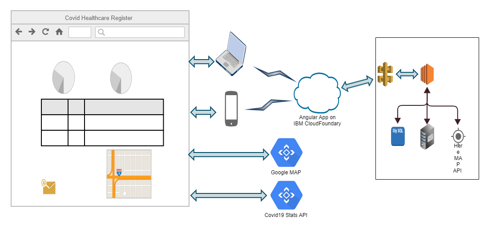

# Submission name

A GitHub repository for Call for Code submissions, by Team Hope

## Contents

1. [Short description](#short-description)
1. [Demo video](#demo-video)
1. [The architecture](#the-architecture)
1. [Project roadmap](#project-roadmap)
1. [Live demo](#live-demo)
1. [Built with](#built-with)
1. [Tech Stack](#tech-stack)

## Short description

### What's the problem?

In the current covid scenario there are many instances when families have been asked to find a hospital that takes covid patients and has beds and ventilators available. Covid hospitals are not accepting patients that are not covid positive (and very few labs are testing this) and non covid hospitals are not taking patients with covid symptoms. So there is lot of gap and hence scope on what to do to spread awareness. There is also a need to get the most updated information from hospitals on beds and ventilators. 

### How can technology help?

Technology can provide realtime information and assistance to users who are in need.

### The idea

Covid Healthcare Register (CHR) aims to help bridge this gap between the users that need Covid hospital information about beds and ventilators and its easy availability on one integrated platform. Via this solution this information is publicly available to users for all locations across India.

## Demo video

## The architecture

### Salient Features of the MVP solution delivered in Hackathon

1.	Users can view the most updated hospital information to view status of available facilities in all registered hospitals across India.
2.	Users can find the direction of any listed hospital facility via google map. This uses HERE APIs which supports IBM cloud.
3.	The information can be publicly accessed by anyone. No login required for users.
4.	If a facility shows unavailable for a hospital, users can subscribe to get notified on hospital bed/ventilator availability. 
5.	We do not take any personal information from the users, only their email id for them to be able to get a notification when a hospital has a facility available. This has been done to maintain confidentiality of patients at the time of requesting for this information and prevent any bias/preference due to age or gender.
6.	Users can submit notifications for multiple hospitals and facilities in one go
7.	Notification service over email. As part of the MVP, hospitals are notified when a new request is submitted and the user is notified about the availability of the services he’s been looking for. 
8.	Login Facility for hospital to register themselves and update item availability count frequently. One time registration is required on the application, post that hospital representatives can login to the application and update the available services as many times as they want. No login required for user.
9.	Hospitals may use the application to update details or can embed our API in their existing software to update the facilities information.
10.	Purge subscriptions older than a week. Requests older than a week are purged to minimize data storage and assuming that users would have either availed the service already or doesn’t need it any more.
11.	Dashboard that states the current Covid global status
12.	Web application can easily be opened in mobile web browser and it will be displayed as per mobile interface

## Project roadmap

To put our MVP into real-time use we plan to add the following enhancements/features in the future.

1.	This solution can be deployed as a mobile application and could prove to be a game changer for the current pandemic as well as any future medical eventualities. The current solution architecture is flexible to be able to enhance for features for any other pandemic if required.
2.	Users will be able to locate a nearby hospital basis their current location. 
3.	The current location tracking feature will be enhanced to incorporate real time proximity data for pathology and pandemic center locations. This will also include location guidance to the nearest covid/pathology center.
4.	The hospital inventory registrations will be augmented by similar support for Covid pathology labs and any or testing centers for future epidemics/pandemics/endemics.
5.	Unsubscribe facility for users. If a user has requested notification earlier, but has found the facilities in another hospital or doesn’t need them anymore he can choose to unsubscribe 
6.	Realtime experience of patients will be captured and supplemented with certifications/accreditations from government bodies to give authentic Ratings and reviews of listed hospitals 
7.	Similar Rating and reviews can also be maintained for pathology labs 
8.	The solution can also be enhanced to prompt an estimated cost for the treatment based on the costing model followed by the hospital 
9.	Location Guidance to nearby Covid Centers (Labs and Hospitals)
10.	There will be IBM Chatbot integration to give the users an interactive experience for their queries.
11.	The Email Notification functionality will also be augmented by SMS notifications.
12.	DNS name configuration for application’s website URL.
13.	Currently, in-memory H2 DB used, it will be replaced with actual cloud based DB.
14.	This solution will be made scalable, high available and fault tolerant utilizing cloud service.

## Live demo

You can find the running application at [covid-healthcare-register](http://covid-healthcare-register-wit2020.eu-gb.mybluemix.net/)

## Built with

* [IBM Cloud-Foundry](https://www.ibm.com/cloud/cloud-foundry) - Angular based website hosted
* [HERE APIs](https://developer.here.com/develop/rest-apis) - IBM recommended geolocation API used
* [AWS EC2](https://aws.amazon.com/ec2/) - Used for backend server
* [Angular](https://angular.io/) - The web framework used
* [Maven](https://maven.apache.org/) - Dependency management

## Tech Stack

### Frontend

Angular 9.1.9, chart.js-2.9.3, ng2-charts-2.3.2, api.covid19api.com, googlemaps-3.39.6

Frontend code deployed on IBM Cloud Foundry

[Frontend Project Code](https://github.com/Neptune212/Covid-Healthcare-Register-UI)

### Backend

Java 8, Spring Boot 2.3.0.RELEASE, in-memory H2 database, HERE APIs

Backend code deployed on AWS EC2

[Backend Project Code](https://github.com/Neptune212/Covid-HealthCare-Register-BE )